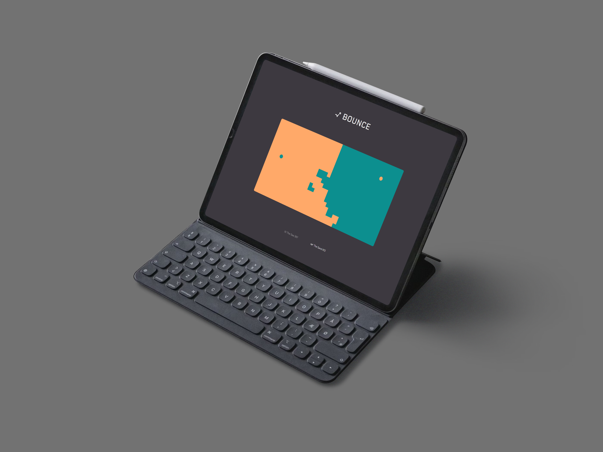

# Bounce

  

## Demo

Check out the live demo of the Bounce [here](https://haghalaz.github.io/bounce/).

## Overview

Welcome to my project called BOUNCE! This project is a test to study the limitations and uses of the Pixi.js library.

## Table of Contents

- [Technologies Used](#technologies-used)
- [Installation](#installation)

## Technologies Used

- **React:** A JavaScript library for building user interfaces.
- **Vite:** A fast build tool that leverages esbuild for quick development and optimized production builds.
- **Tailwind CSS:** A utility-first CSS framework for rapidly building custom designs.
- **Pixi.js:** A fast 2D rendering engine for the web, allowing the creation of interactive graphics and games using WebGL or HTML5 canvas.

## Installation

1. Clone the repository: `git clone https://github.com/Haghalaz/bounce.git`
2. Navigate to the project directory: `cd bounce`
3. Install dependencies: `npm install`
4. Start the development server: `npm run dev`
5. Open your browser and go to `http://localhost:5173/bounce/`

Thank you for visiting my bounce!
